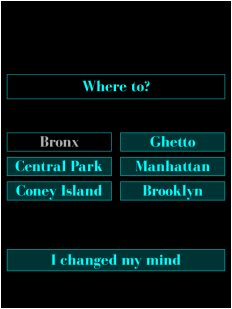

# Dope Trader

Dope Trader is a turn-based commodity trading game.

You play the role of a drug dealer in debt. You have one month to trade drugs and repay your debt.

One day passes when you travel to a new location. Each day prices fluctuate due to market demand. When a drug is not in demand it cannot be traded.

Carrying more merchandise increases the risk of rival gang encounters. You can fight back and take their cash if you have guns. Your chance to hit a thug increases with each gun you carry.

Purchasing guns happens randomly when you go to a new location.

The game is inspired by the 1984 classic by John Dell, "Drug Wars".

# Screenshots

[](screenshots/menu.png)
[](screenshots/trading.png)
[](screenshots/jet.png)
[](screenshots/loanshark.png)
[](screenshots/messages.png)
[](screenshots/purchase.png)
[](screenshots/thugs.png)
[](screenshots/scores.png)

# Download It

Get the latest release on [the releases page](https://github.com/wesleywerner/dopetrader/releases).

# Play It

You need the Löve 2D game engine to play. See the [Löve website](https://love2d.org) for installation instructions on your platform.

## Android

Install the [Löve Android](https://play.google.com/store/apps/details?id=org.love2d.android) app and tap `dopetrader.love` to launch.

## GNU / *nix

```
love dopetrader.love
```

## Windows

A Windows build is available on the releases page above.

# Tutorial

The in-game tutorial runs the first time you play. It can be restarted from the Options menu.

# License

> Copyright 2021 Wesley Werner
>
> This program is free software: you can redistribute it and/or modify
> it under the terms of the GNU General Public License as published by
> the Free Software Foundation, either version 3 of the License, or
> any later version.
>
> This program is distributed in the hope that it will be useful,
> but WITHOUT ANY WARRANTY; without even the implied warranty of
> MERCHANTABILITY or FITNESS FOR A PARTICULAR PURPOSE.  See the
> GNU General Public License for more details.
>
> You should have received a copy of the GNU General Public License
> along with this program in the file named COPYING.
> If not, see http://www.gnu.org/licenses/.

# Acknowledgements

Many thanks to these people for sharing their work:

**Cannabis Leaf Image**
by kotik
[Licensed CC0 1.0 Public Domain](http://creativecommons.org/publicdomain/zero/1.0/)
[[Source](https://openclipart.org/detail/3579/cannabis)]
(Changes: scaled and desaturated)

**BodoniFLF Font**
by Casady & Greene
[Licensed Freeware, Non-Commercial](https://www.fontspace.com/help#license-2)
[[Source](https://www.fontspace.com/bodoniflf-font-f1202)]

**Pistol Sound**
by Q009
[Licensed CC-BY-SA 3.0](http://creativecommons.org/licenses/by-sa/3.0/)
[[Source](https://opengameart.org/content/q009s-weapon-sounds)]

**Sell / Buy Sound**
by artisticdude
[Licensed CC-BY-SA 3.0](http://creativecommons.org/licenses/by-sa/3.0/)
[[Source](https://opengameart.org/content/inventory-sound-effects)]

**Grunt Sound**
by n3b
[Licensed CC-BY 3.0](http://creativecommons.org/licenses/by/3.0/)
[[Source](https://opengameart.org/content/grunt)]

**Cash Register Sound**
by kiddpark
[Licensed CC-BY 3.0](http://creativecommons.org/licenses/by/3.0/)
[[Source](https://freesound.org/people/kiddpark/sounds/201159/)]

**Running Sound**
by mieki256
[Licensed CC0 1.0 Public Domain](http://creativecommons.org/publicdomain/zero/1.0/)
[[Source](https://opengameart.org/content/jump-and-run-and-stand)]
(Changes: Increased tempo to shorten audio duration)

**Subway Sound**
by 16gpizap
[Licensed CC-BY 3.0](http://creativecommons.org/licenses/by/3.0/)
[[Source](https://freesound.org/people/16gpizap/sounds/499424/)]
(Changes: Trimmed with fade-in/out to shorten audio duration)

**Applause Sound**
"Well Done" Copyright 2013 by Iwan Gabovitch <qubodup.net>
[Licensed CC-BY 3.0](http://creativecommons.org/licenses/by/3.0/)
[[Source](https://opengameart.org/content/well-done)]

